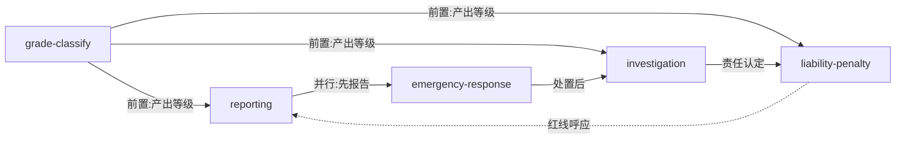

# 《电力安全事故应急处置和调查处理条例》— Skill Index

> 本书由 cangjie-skill 蒸馏，共产出 **5** 个 skills。
> 处理时间: 2026-09-17

## 关于这本书

- **制定机关**: 中华人民共和国国务院（第599号公布，第845号修订）
- **施行日期**: 2027-01-01
- **一句话主旨**: 规定电力安全事故从报告、应急处置、调查处理到法律责任的全链条法定要求，并附事故等级划分标准。
- **整书理解**: 见 [BOOK_OVERVIEW.md](./BOOK_OVERVIEW.md)
- **精华长文**: 见 [DIGEST.md](./DIGEST.md)
- **术语词典**: 见 [GLOSSARY.md](./GLOSSARY.md)

---

## Skill 列表（按主题分组）

### 事故定级（前置）
- [`power-accident-grade-classify`](./power-accident-grade-classify/SKILL.md) — 按减供负荷/停电用户/变电站影响等五维度判定特别重大/重大/较大/一般。

### 事故报告
- [`power-accident-reporting`](./power-accident-reporting/SKILL.md) — 逐级报告链、五要素内容、补报规则与迟报瞒报红线。

### 事故应急处置
- [`power-accident-emergency-response`](./power-accident-emergency-response/SKILL.md) — 紧急处置、调度命令权（拉限/解列）、恢复优先序、大面积停电应急与信息发布。

### 事故调查处理
- [`power-accident-investigation`](./power-accident-investigation/SKILL.md) — 管辖权限矩阵、调查组组成、期限、报告六要素、批复与整改评估。

### 法律责任与罚则
- [`power-accident-liability-penalty`](./power-accident-liability-penalty/SKILL.md) — 禁止行为（失败模式）+ 单位/个人罚款矩阵 + 5年禁任。

---

## 引用图



图例:
- `-->`  depends-on / 顺序
- `-.->` contrasts-with / 呼应

---

## 推荐学习顺序

1. **power-accident-grade-classify** — 最底层，定级是后续一切动作的前提
2. **power-accident-reporting** — 事故后第一动作（与处置并行）
3. **power-accident-emergency-response** — 防止扩大的关键窗口
4. **power-accident-investigation** — 事后追责依据
5. **power-accident-liability-penalty** — 合规红线与代价

---

## 安装使用

本目录是构建产物，宿主不会从这里加载 skill。要让 agent 真正调用，把 skill 目录复制到宿主的 skills 目录：

```bash
# 用户级（所有项目可用）
cp -r power-accident-grade-classify ~/.workbuddy/skills/
# … 其余 4 个同理

# 或项目级
cp -r power-accident-grade-classify <project>/.workbuddy/skills/
```

---

## 接入 darwin-skill

所有 skill 均带有 `test-prompts.json`（darwin-skill 兼容格式），可直接接入自动进化：

```
darwin evolve books/power-accident-reg-599/
```

---

## 审计轨迹

- 候选单元池: [candidates/](./candidates/)
- 被淘汰的候选（含原因）: [rejected/](./rejected/)
- BOOK_OVERVIEW: [BOOK_OVERVIEW.md](./BOOK_OVERVIEW.md)
- 验证结果: [verified.md](./verified.md)
