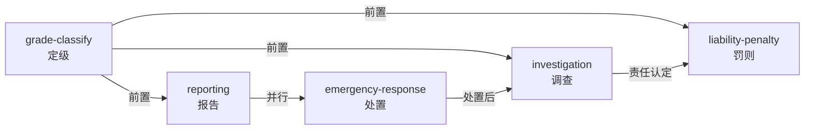

[README.md](https://github.com/user-attachments/files/32333687/README.md)
# 电力安全事故应急处置和调查处理条例 · Agent Skills

> 《电力安全事故应急处置和调查处理条例》（国务院令第599号公布，第845号修订）蒸馏而成的一套可执行 Agent Skills。
> 把一部法规变成 5 个「什么时候用 / 怎么判断 / 罚则多重」的可调用技能。

[](./LICENSE)
[](#-skill-清单)
[](https://code.claude.com/docs/en/skills)

---

## 这是什么

这是一套 **Agent Skill**（技能包）。每个 skill 是一个独立目录，包含一份 `SKILL.md`——当 AI Agent（Claude Code / WorkBuddy / 任何支持 skill 的宿主）识别到匹配场景时，会加载它并按其指引完成任务。

**不是**法规全文的搬运，而是把条例中「可执行的判断逻辑」提炼成 agent 能直接使用的程序化知识。

### 解决的问题

电力安全事故发生后，现场人员与监管人员通常面对四类高频问题：

| 问题 | 对应 skill |
|---|---|
| 这起事故算几级？ | `power-accident-grade-classify` |
| 该向谁报告、多久内报告、报什么？ | `power-accident-reporting` |
| 现在必须立即做什么处置？调度有什么命令权？ | `power-accident-emergency-response` |
| 谁组织调查、多久出报告、批复后怎么整改？ | `power-accident-investigation` |
| 哪些行为会被重罚？罚多少？多久禁任？ | `power-accident-liability-penalty` |

---

## 🚀 快速开始（复制即用）

### 方式一：只取你需要的 skill（推荐）

```bash
git clone https://github.com/yan-ian/power-accident-reg-599-skills.git
cp -r power-accident-reg-599-skills/skills/power-accident-grade-classify ~/.workbuddy/skills/
```

### 方式二：全部安装（用户级，所有项目可用）

```bash
git clone https://github.com/yan-ian/power-accident-reg-599-skills.git
cp -r power-accident-reg-599-skills/skills/* ~/.workbuddy/skills/
```

### 方式三：项目级安装（只对当前项目生效）

```bash
cp -r power-accident-reg-599-skills/skills/* <your-project>/.workbuddy/skills/
```

> **Claude Code 用户**：把 `~/.workbuddy/skills/` 换成 `~/.claude/skills/`，其余不变。
> 宿主加载机制不同，但 `SKILL.md` 的格式与语义是一致的。

### 验证安装

安装后向 agent 直接提问即可，例如：

```
电网负荷 10000MW 的省网，事故减供 6000MW，这起事故算几级？
```

命中 skill 后应回答：**特别重大事故**（减供比例 60% ≥ 50%），并说明由国务院组织调查。

---

## 📦 Skill 清单

| Skill | 触发场景 | 核心产出 |
|---|---|---|
| **[power-accident-grade-classify](./skills/power-accident-grade-classify/SKILL.md)** | 「这起事故算几级」 | 五维度取高定级（特别重大/重大/较大/一般） |
| **[power-accident-reporting](./skills/power-accident-reporting/SKILL.md)** | 「向谁报告、多久报」 | 逐级报告链 + 五要素内容 + 迟报瞒报红线 |
| **[power-accident-emergency-response](./skills/power-accident-emergency-response/SKILL.md)** | 「现在立即做什么」 | 紧急处置 + 调度命令权 + 恢复优先序 |
| **[power-accident-investigation](./skills/power-accident-investigation/SKILL.md)** | 「谁调查、多长期限」 | 管辖权限矩阵 + 调查期限 + 批复整改 |
| **[power-accident-liability-penalty](./skills/power-accident-liability-penalty/SKILL.md)** | 「罚多少、禁任多久」 | 禁止行为清单 + 单位/个人罚款矩阵 |

### 依赖关系



**推荐使用顺序**：定级 → 报告/处置（并行）→ 调查 → 罚则。

---

## 🧠 设计原理

每个 `SKILL.md` 采用 **RIA++ 结构**（源自 cangjie-skill 蒸馏方法论）：

| 段落 | 含义 |
|---|---|
| **R** — Reading | 法规原文引用（可追溯到具体条文） |
| **I** — Interpretation | 方法论骨架：判定逻辑、优先级、边界 |
| **A1** — Past Application | 书中的应用案例 |
| **A2** — Future Trigger ★ | 触发场景 + 语言信号（决定 skill 何时被唤起） |
| **E** — Execution | 可执行的步骤清单 |

`description` 字段同时写明**正向 trigger**与**负向排除**（`不适用于…`），避免与相邻 skill 串味——例如「事故定级」明确排除纯人员伤亡事故（应转《生产安全事故报告和调查处理条例》）。

---

## 📁 仓库结构

```
.
├── README.md                    ← 你在这里
├── LICENSE                      ← MIT
├── CHANGELOG.md                 ← 版本记录
├── CONTRIBUTING.md              ← 贡献指南
├── BOOK_OVERVIEW.md             ← 条例整书理解
├── DIGEST.md                    ← 条例精华长文（通读版）
├── GLOSSARY.md                  ← 术语词典（8 条关键术语）
├── INDEX.md                     ← 蒸馏产物索引与审计轨迹
├── knowledge-base/
│   └── index.html               ← 交互式知识库（单文件离线，见下方）
└── skills/                      ← ★ 安装这个目录
    ├── power-accident-grade-classify/
    │   ├── SKILL.md
    │   └── test-prompts.json    ← darwin 兼容测试用例
    ├── power-accident-reporting/
    ├── power-accident-emergency-response/
    ├── power-accident-investigation/
    └── power-accident-liability-penalty/
```

### 配套交互式知识库

`knowledge-base/index.html` 是一个**单文件离线**的交互式知识库，可直接双击打开（或部署到 GitHub Pages）：

- **事故等级判定器**：选电网类型 + 负荷档，填减供比例 → 实时输出等级与命中依据
- **全文检索**：跨 38 条法规高亮过滤
- **结构化视图**：报告链、调度命令权、调查管辖矩阵、罚则矩阵

> 无需服务器、无需联网，单文件自包含（内嵌 CSS/JS）。

---

## ⚖️ 法源与时效

- **法源**：《电力安全事故应急处置和调查处理条例》
- **文号**：国务院令第 **599** 号公布（2011 年）；国务院令第 **845** 号修订（2026-08-30）
- **施行**：**2027-01-01**
- **结构**：6 章 38 条 + 附件《电力安全事故等级划分标准》

> **注意**：本 skill 包内容依据上述版本蒸馏。法规修订后，定级阈值与罚则金额可能变动，**实际执法请以最新官方文本为准**。

---

## 🧪 测试

每个 skill 附带 `test-prompts.json`，采用 darwin-skill 兼容格式，内含正例、反例与**跨 skill 诱饵**（用于检验是否会误触发相邻 skill）。

```bash
# 接入 darwin-skill 自动进化（如已安装）
darwin evolve skills/
```
---

## 🤝 贡献

欢迎提交 issue 或 PR。优先接受以下类型：

- **法规更新**：条例修订后同步阈值与罚则
- **新增案例**：真实场景的定级/报告/调查实践
- **触发出错修复**：skill 误触发或漏触发的 prompt 样本

详见 [CONTRIBUTING.md](./CONTRIBUTING.md)。

---

## 📄 License

[MIT](./LICENSE) © 2026 yan-ian

---

## 致谢

本 skill 包由 [cangjie-skill](https://github.com/yan-ian) 蒸馏流水线产出：整书理解 → 5 路并行提取 → 三重验证 → RIA++ 构造 → 压力测试 → 打包交付。
